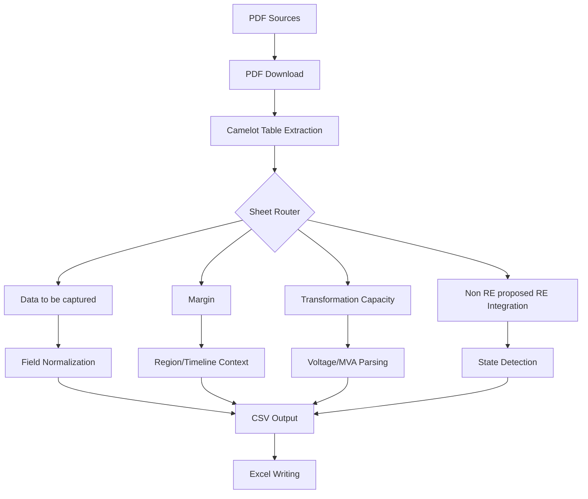
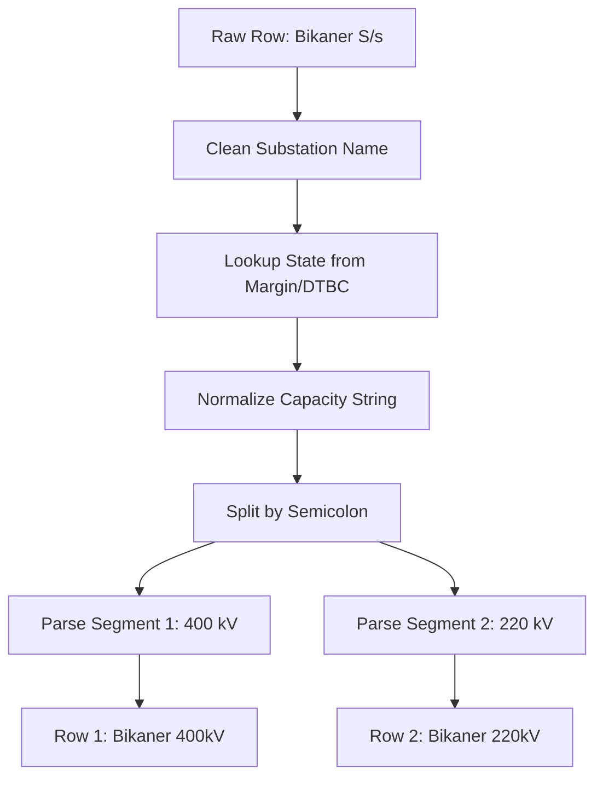

# CTU Automated PDF Data Extraction - Complete Project Documentation

## Table of Contents
0. [Quick Reference: All Techniques Used](#0-quick-reference-all-techniques-used)
1. [Project Overview](#1-project-overview)
2. [Technology Stack](#2-technology-stack)
3. [File Structure and Purpose](#3-file-structure-and-purpose)
4. [Data Flow Architecture](#4-data-flow-architecture)
5. [Sheet-by-Sheet Extraction Details](#5-sheet-by-sheet-extraction-details)
6. [Core Functions and Techniques](#6-core-functions-and-techniques)
7. [Configuration Reference](#7-configuration-reference)
8. [Known Issues and Limitations](#8-known-issues-and-limitations)
9. [Example Data Transformations](#9-example-data-transformations)

---

## 0. Quick Reference: All Techniques Used

### Extraction Techniques
| Technique | Where Used | Description |
|-----------|------------|-------------|
| **Camelot Lattice** | SN9 Margin, Transformation Capacity, Non RE | Table extraction with clear borders |
| **Camelot Default (line_scale=40)** | SN1 PDFs | Table extraction with border detection tuning |
| **Page Range Filtering** | SN1 | Extract only pages 11-end (skip intro pages) |
| **Column Alignment Fixing** | SN1 | Split merged "1. 2200000788" into separate columns |
| **Serial Number Continuity Detection** | SN1 | Detect continuation tables (table1 ends 5, table2 starts 6) |
| **Repeated Header Removal** | SN1 | Remove duplicate header rows after table merging |
| **Dynamic Header Detection** | SN1, All PDFs | Keyword matching with column mapping |
| **Header Heuristic with Slice** | Element Status | Detect data table by searching first 5 rows for "SN" + "Scope" |
| **Continuation Table Handling** | All sheets | Persist headers across page breaks |

### Data Transformation Techniques
| Technique | Where Used | Description |
|-----------|------------|-------------|
| **Capacity String Normalization** | Transformation Capacity | Insert semicolons in concatenated strings |
| **Regex-based Voltage Extraction** | Transformation Capacity | Extract rightmost voltage (handles kV and KV) |
| **MVA Formula Calculation** | Transformation/Margin | Parse "4x500MVA" or "3x1500" → product |
| **Row Splitting by Voltage** | Transformation Capacity | One source row → multiple output rows |
| **State-to-Region Mapping** | SN1, All sheets | State name → Region code (Rajasthan → WR) |
| **Dual-Source State Lookup** | Transformation Capacity | Try Margin first, then DTBC |
| **Fuzzy Name Matching** | State lookup | Exact → Core name → Partial match |
| **Substation Cache Optimization** | SN1 | Scan PDF text ONCE, cache developer→substation mappings |

### Context Tracking Techniques
| Technique | Where Used | Description |
|-----------|------------|-------------|
| **Region Header Detection** | Margin | Track "Northern Region" → NR |
| **Timeline Header Detection** | Margin | Track "Commissioning Between..." |
| **State Header Detection** | Non RE | Track state from section headers |
| **Context Persistence** | All multi-table PDFs | Maintain region/timeline across tables |
| **Custom Serial Numbering** | Margin | Generate hierarchical sl_no (1, 1a, 1b) |
| **State Propagation** | Margin | Copy state from sub-rows to parent |

### Filtering & Cleaning Techniques
| Technique | Where Used | Description |
|-----------|------------|-------------|
| **Folder-based Routing** | SN9 sheets | Route PDFs to correct sheet by subfolder |
| **Status Detection with Developer Validation** | SN1 | Only assign status if developer name mentioned in context |
| **State Extraction from Location** | SN1 | District-to-state lookup (38 Rajasthan + 33 Gujarat districts) |
| **Region Code Standardization** | SN1 | Convert state to region code (Rajasthan → WR, Punjab → NR) |
| **Substation Extraction from Text** | SN1 | Extract confirmed substations from narrative ("agreed to grant...at X PS") |
| **Quantum Value Splitting** | SN1 | Split "300 (reduced to 250)" into app/granted quantum |
| **Subtotal/Total Filtering** | Margin, Non RE | Skip summary rows |
| **Footer Note Filtering** | Margin | Skip notes >50 chars with patterns |
| **Substation Name Cleaning** | All Sheets | Remove voltage, GIS/AIS, fix brackets "Fatehgarh-IV (Section-II" → "Fatehgarh-IV" |
| **Regional Hub Normalization** | Non RE | "Paradeep" → "Odisha" |
| **LTA ID Auto-Extraction** | Data to be captured | Split LTA: prefix from application IDs |
| **Numeric Type Conversion** | Excel writing | Convert string numbers to numeric |
| **Forward Fill** | Transformation Capacity | Fill empty s_no/substation from previous row |

### PDF Structure Detection Techniques
| Technique | Where Used | Description |
|-----------|------------|-------------|
| **Column Count Detection** | All sheets | 20 cols → Margin, 13 cols → Non RE, etc. |
| **Lattice vs Stream Auto-detect** | Transformation Capacity | 20 cols = Lattice, 18 cols = Stream |
| **Header Skip Calculation** | Per PDF type | Lattice: skip 4 rows, Stream: skip 2 rows |
| **Empty Row Detection** | Transformation Capacity | Filter rows with no capacity data |

### Regex Patterns Used
| Pattern | Purpose | Example |
|---------|---------|--------|
| `([Kk][Vv])(\d)` | kV followed by digit | "kV2x500" → "kV; 2x500" |
| `(\d+)\s*[Kk][Vv]` | Voltage extraction | "400/220kV" → 220 |
| `(\d+)\s*[xX×]\s*(\d+(?:\.\d+)?)` | MVA/CoD Calc | "4x500" → 2000, "3x1500" → 4500 |
| `LTA[:\s]*([\d]+)` | LTA ID extraction | "LTA:1234" → 1234 |
| `^\d+(?:/\d+)*\s*k[Vv]\s*` | Voltage prefix removal | "400/220kV Jam..." → "Jam..." |
| `(?:agreed\s+to\s+grant\|granted).*?at\s+([A-Za-z-]+)\s*(?:ps\|s/s)` | Substation from confirmed grant | "agreed to grant...at Ramgarh-II PS" → Ramgarh-II |

---

## 1. Project Overview

### Purpose
This project automates the extraction of renewable energy and power grid data from PDF documents published by CTU (Central Transmission Utility of India) and CEA (Central Electricity Authority). The extracted data is consolidated into a structured Excel workbook for analysis.

### What It Does
1. **Scrapes** PDF download links from official CTU/CEA websites
2. **Downloads** PDF files to organized local folders
3. **Extracts** tabular data from PDFs using Camelot (table extraction library)
4. **Transforms** raw data into standardized formats
5. **Writes** cleaned data to Excel sheets matching a predefined template

### Input Sources
| Source ID | URL | Description | Status |
|-----------|-----|-------------|--------|
| SN1 | ctuil.in/ists-consultation-meeting | ISTS Consultation Meeting PDFs | ✅ Integrated |
| SN3 | ctuil.in/regenerators | RE Generator data | ✅ Working |
| SN4 | ctuil.in | Additional connectivity data | ⏳ Pending integration |
| SN9 | ctuil.in/renewable-energy | Renewable Energy zone data | ✅ Working |
| SN10a | cea.nic.in | RE Integration transmission data | ✅ Working |

### Output
- **Excel File**: `Connectivity_Application_Data_TEST_ALL_SHEETS36.xlsx`
- **CSV Files**: Individual CSV files in `extraction_output/` folder for each sheet

---

## 2. Technology Stack

### Core Libraries
| Library | Version | Purpose |
|---------|---------|---------|
| **Camelot** | - | PDF table extraction (primary method) |
| **openpyxl** | - | Excel file reading/writing |
| **pandas** | - | Data manipulation and transformation |
| **PyMuPDF (fitz)** | - | PDF text extraction (fallback) |
| **pdfplumber** | - | Table extraction for Element Status sheet |

### Extraction Flavors
- **Lattice**: Used for PDFs with clear table borders (SN9 Margin, Transformation Capacity)
- **Stream**: Used for PDFs without clear borders (SN1 application tables)

### 3-Tier Extraction Approach
```
┌─────────────────────────────────────────────────────────────────┐
│                    PDF Extraction Pipeline                       │
├─────────────────────────────────────────────────────────────────┤
│  TIER 1: Camelot Table Extraction (Fastest, Most Accurate)      │
│          ↓ (if no tables found)                                  │
│  TIER 2: PyMuPDF Text Extraction                                 │
└─────────────────────────────────────────────────────────────────┘
```

---

## 3. File Structure and Purpose

### Core Pipeline Files

| File | Purpose |
|------|---------|
| `test_main_skip_download.py` | **Main test script** - Runs complete extraction pipeline without re-downloading PDFs |
| `main.py` | Production pipeline with full scraping/downloading |
| `config.py` | Central configuration (sources, sheet mappings, prompts) |
| `field_mappings.py` | Field definitions, header normalization, parsing functions |
| `pdf_processor.py` | PDF extraction using Camelot/PyMuPDF/Docling |
| `excel_handler.py` | Excel writing with template preservation |
| `prompts.py` | LLM prompts for text-based extraction (legacy) |
| `scraper.py` | Website scraping for PDF links |
| `downloader.py` | PDF file downloading |

### Key Data Files

| File | Purpose |
|------|---------|
| `Connectivity Application Data.xlsx` | Template Excel file with predefined structure |
| `extraction_output/*.csv` | Intermediate CSV outputs for verification |

---

## 4. Data Flow Architecture

### Overall Flow Diagram


### Sheet-to-Source Mapping
```python
SHEET_CONFIG = {
    "Data to be captured": {
        "sources": ["SN1", "SN3", "SN2", "SN4", "SN7", "SN8", "SN9", "SN11"]
    },
    "Margin": {
        "sources": ["SN9"]  # From "Connectivity Margin" subfolder
    },
    "Transformation Capacity": {
        "sources": ["SN9"]  # From bay allocation PDF
    },
    "Non RE proposed RE Integration": {
        "sources": ["SN9"]  # From "non RE" subfolder
    },
    "Element Status": {
        "sources": ["SN_TBCB"]  # From Report_TBCB_UC.pdf
    }
}
```

---

## 5. Sheet-by-Sheet Extraction Details

---

### 5.1 Data to be Captured Sheet

#### Source
- **Primary**: SN1 (ISTS Consultation Meeting PDFs)
- **Secondary**: SN3, SN9, and other sources

#### PDF Structure
- 11-column table structure in SN1 PDFs
- Multi-row headers (rows 0-5 combined)
- Data starts around row 10-11
- Contains narrative text mixed with data (meeting minutes)

#### Column Mapping (41 Fields)
```python
DATA_TO_BE_CAPTURED_FIELDS = [
    "sr_no", "region", "state", "substation", "coordinates",
    "name_of_developers", "group", 
    "gna_st_ii_application_id", "lta_application_id",
    "application_id_enhancement_5_2_or_revision",
    "cmets_gna_approved", "cmets_lta_approved",
    "cmets_gna_meeting_date", "cmets_lta_meeting_date",
    "type", "application_quantum_mw", "granted_quantum_gna_lta_mw",
    "installed_breakup_solar_mw", "installed_breakup_wind_mw", "installed_breakup_hybrid_mw",
    "battery_mwh", "battery_injection_mw", "battery_drawl_mw",
    "psp_mwh", "psp_injection_mw", "psp_drawl_mw",
    "commissioned_tgna", "commissioned_gna",
    "application_date", "mode", "applied_start_of_connectivity",
    "gna_operationalization", "gna_operationalization_yes_no",
    "date_for_additional_capacity", "nature_of_applicant", "status_of_application",
    "voltage_level_kv", "bay_no", "cts_element_unique_code", "ats_element_unique_code"
]
```

#### Extraction Rules
1. **Header Detection**: Look for keywords like "Sl. No", "Application ID", "Developer"
2. **Narrative Filtering**: Remove rows with >100 chars or meeting keywords ("It was informed", "M/s")
3. **LTA ID Splitting**: Auto-extract LTA IDs from combined application ID fields
4. **Region Standardization**: Extract state from location → Map state to region code (NR/WR/SR/ER/NER)
5. **Substation Extraction**: Scan narrative text for confirmed grants, cache results for fast lookup

#### SN1-Specific Logic (Integrated from AkashNeeli's Code)

##### 1. Table Extraction
```python
# Extract pages 11-end with line_scale=40 for border detection
tables = camelot.read_pdf(pdf_path, pages='11-end', line_scale=40, suppress_stdout=True)
```

##### 2. Column Alignment Fixing
```python
def fix_sn1_column_alignment(table_df):
    """Fix merged cells like '1. 2200000788' → separate columns"""
    if first_col is empty and "." in second_col:
        parts = second_col.split(".", 1)
        if parts[0].strip().isdigit():
            df.iloc[i, 0] = parts[0].strip()  # Serial number
            df.iloc[i, 1] = parts[1].strip()  # Application ID
```

##### 3. Continuation Table Merging
```python
def are_sn1_tables_related(df1, df2):
    """Check if tables should be merged using serial number continuity"""
    # If df1 ends with serial 5 and df2 starts with 6 → merge
    if first_serial == last_serial + 1:
        return True

def merge_sn1_related_tables(table_dfs):
    """Merge continuation tables and remove repeated headers"""
    # Concatenate related tables
    # Remove duplicate header rows (>80% cell match)
```

##### 4. Dynamic Header Detection
```python
SN1_HEADER_KEYWORDS = ['sl', 'no', 'application', 'id', 'applicant', 'location', 
                        'date', 'nature', 'quantum', 'connectivity', 'region', 'criterion', 'mode']

def detect_sn1_header_row(df):
    """Detect header row and create column mapping"""
    # Returns: (header_row_idx, column_mapping)
    # column_mapping: {'serial': 0, 'app_id': 1, 'applicant': 2, ...}
```

##### 5. State Extraction from Location
```python
RAJASTHAN_DISTRICTS = ["Ajmer", "Barmer", "Bikaner", "Jaisalmer", "Jodhpur", ...]
GUJARAT_DISTRICTS = ["Ahmedabad", "Kutch", "Rajkot", "Surat", ...]

def extract_state_from_location(location_text):
    """Extract state from district/location text"""
    # 'Sirohi distt., Rajasthan' → 'Rajasthan'
    # 'Barmer' → 'Rajasthan' (district lookup)
```

##### 6. Status Detection with Developer Validation
```python
def detect_status_for_developer(df, current_row_idx, developer_name):
    """Only assign status if developer name is mentioned in context"""
    # Look ahead up to 7 rows, stop at next serial number
    # Check if developer name (key words) appears in same row as status
    # Keywords: 'withdrawn', 'granted', 'revoked', 'closed', 'agreed'
```

##### 7. Quantum Value Splitting
```python
def process_sn1_quantum_value(quantum_str):
    """Split quantum into application and granted values"""
    # '300 (reduced to 250)' → ('300', '(reduced to 250)')
    # '150' → ('150', '')
```

##### 8. SN1 Field Mapping to Canonical Fields
| PDF Column | Canonical Field | Notes |
|------------|-----------------|-------|
| Sl. No | `sr_no` | Serial number |
| Application ID | `gna_st_ii_application_id` or `lta_application_id` | Numeric → GNA, Non-numeric → LTA |
| Applicant | `name_of_developers` | Developer/Company name |
| Project Location | `state` | District lookup for state extraction |
| Project Location | `region` | State→Region mapping (WR/NR/SR/ER/NER) |
| Submission Date | `application_date` | DD.MM.YYYY format |
| Nature of Applicant | `nature_of_applicant` | Generator (Solar), etc. |
| Connectivity Quantum | `application_quantum_mw` | Application quantum |
| (Parenthetical) | `granted_quantum_gna_lta_mw` | Granted quantum if different |
| Start Date of Connectivity | `applied_start_of_connectivity` | DD.MM.YYYY format |
| Criterion for applying | `mode` | Land BG Route, Land Route, etc. |
| Status (look-ahead) | `status_of_application` | Withdrawn, Granted, Revoked |
| (Narrative text) | `substation` | Extracted from confirmed grants only |

##### 9. Substation Extraction from Narrative Text
```python
def extract_sn1_substation_from_text(pdf_text, developer_name):
    """
    Extract confirmed substation for a developer from PDF narrative text.
    Only extracts when there's confirmation (agreed, granted, approved).
    
    Uses caching for performance - scans PDF text ONCE, then fast lookups.
    
    Example matches:
    - "agreed to grant 400 MW connectivity to M/s XYZ at 220 kV Ramgarh-II PS"
    - "granted connectivity to M/s ABC at Bikaner S/s"
    
    NOT matched (unconfirmed):
    - "M/s XYZ has applied for connectivity at Ramgarh PS"  # Just applied
    """
    # Build cache on first call (scans 166K+ chars ONCE)
    # Pattern: "agreed/granted/approved X MW to M/s [Developer] at [Substation] PS"
    confirmed_pattern = r'(?:agreed\s+to\s+grant|granted|approved)\s+[\d,]+\s*mw[^.]*?(?:to\s+)?m/s\.?\s*([^,]+?)\s+at\s+(?:\d+(?:/\d+)?\s*k[vV]\s+)?([A-Za-z][A-Za-z0-9\-]+)\s*(?:ps|s/s|substation)'
    
    # Cache stores: {developer_name: substation_name}
    # Subsequent calls do O(1) dictionary lookup
```

---

### 5.2 Margin Sheet

#### Source
- **SN9**: PDFs from "Connectivity Margin" subfolder only

#### PDF Structure
- **20 columns** in lattice mode
- **4 header rows** (rows 0-3 are column headers)
- Data starts at row 4
- Contains **region headers** ("Northern Region", "Southern Region")
- Contains **timeline headers** ("Existing RE Pooling Station", "Commissioning Between Jul-25 to Dec-25")

#### Column Mapping (24 Fields)
```python
MARGIN_FIELDS = [
    "sl_no", "state", "region", "pooling_ss", 
    "additional_information_of_pooling_ss", "timelines",
    "re_potential_mw", "bess_mw", "ss_evacuation_capacity_mw",
    "expected_cod_of_pooling_station",
    "connectivity_granted_1_200kv_mw", "connectivity_granted_1_400kv_mw", 
    "connectivity_granted_1_total_mw",
    "connectivity_granted_2_200kv_mw", "connectivity_granted_2_400kv_mw", 
    "connectivity_granted_2_total_mw",
    "margin_for_connectivity_200kv_mw", "margin_for_connectivity_400kv_mw", 
    "margin_for_connectivity_total_mw",
    "additional_margin_200kv_mw", "additional_margin_400kv_mw", 
    "additional_margin_total_mw",
    "effectiveness_of_gna", "remarks"
]
```

#### Extraction Rules

##### 1. Folder Filtering
```python
# Only process PDFs from Connectivity Margin folder
is_margin_folder = 'Connectivity Margin' in pdf_folder or 'margin' in pdf_folder.lower()
if sheet_name == "Margin" and not is_margin_folder:
    return pd.DataFrame()  # Skip non-Margin PDFs
```

##### 2. Region Context Tracking
```python
# Track current region as we iterate through rows
current_region = None
if "northern region" in combined_text:
    current_region = "NR"
elif "southern region" in combined_text:
    current_region = "SR"
elif "western region" in combined_text:
    current_region = "WR"
```

##### 3. Timeline Context Tracking
```python
# Extract exact timeline from PDF header rows
current_timeline = None
if "existing re pooling station" in combined_text:
    current_timeline = "Existing"
elif "commissioning between" in combined_text:
    # Extract: "Commissioning Between Jul-25 to Dec-25"
    current_timeline = f"Between {date_part}"
elif "beyond dec" in combined_text:
    current_timeline = "Beyond Dec-25"
```

##### 4. Custom Serial Numbering
```python
# Generate hierarchical sl_no (1, 1a, 1b, 2, 2a, etc.)
if sl_no_val.isdigit():
    custom_serial_counter += 1
    parent_sl_no = custom_serial_counter
    final_sl_no = str(custom_serial_counter)
elif sl_no_val.isalpha() and len(sl_no_val) == 1:
    # Sub-row (a, b, c)
    final_sl_no = f"{parent_sl_no}{sl_no_val}"
```

##### 5. Pooling Station Name Extraction
```python
def extract_additional_info_from_pooling_ss(pooling_ss_value):
    """
    Examples:
    - 'Fatehgarh-III (Section-I)' → ('Fatehgarh-III', 'Section-I')
    - 'Pavagada (expansion with ICTs)' → ('Pavagada', 'expansion with ICTs')
    """
    # Extract content in parentheses
    parentheses_pattern = r'\s*\(([^)]+)\)\s*$'
    match = re.search(parentheses_pattern, station_name)
    if match:
        additional_info = match.group(1).strip()
        station_name = station_name[:match.start()].strip()
    return (station_name, additional_info)
```

##### 6. State Propagation
```python
def propagate_state_to_parent_complex(records):
    """
    Copy state from sub-rows (1a, 1b) to parent row (1) if parent has no state
    """
    for parent_num, sub_rows in parent_map.items():
        if parent_record has no state:
            # Find state from sub-rows
            sub_states = [sub_row.get('state') for sub_row in sub_rows]
            parent_record['state'] = most_common(sub_states)
```

##### 7. Numeric Conversion
```python
def to_numeric(val):
    """Convert MW values to numeric, handling commas"""
    cleaned = val_str.replace(',', '')
    return float(cleaned)
```

---

### 5.3 Transformation Capacity Sheet

#### Source
- **SN9**: Bay Allocation Status PDF (NOT from Connectivity Margin folder)

#### PDF Structure
- **20 columns** in lattice mode, 18 columns in stream mode
- Column 4: Planned capacity
- Column 5: Existing capacity  
- Column 6: Under Implementation capacity

#### Column Mapping (8 Fields)
```python
TRANSFORMATION_CAPACITY_FIELDS = [
    "s_no", "region", "state", "substation", "voltage_level_kv",
    "existing_mva", "under_implementation_mva", "planned_mva"
]
```

#### The Core Challenge
Capacity values in PDF are **combined strings** with voltage and MVA formulas:
```
"1x1500 MVA, 765/400 kV; 4X500 MVA, 400/220 KV"
```

This single string needs to be:
1. **Normalized** (add separators)
2. **Split** into segments
3. **Parsed** to extract voltage and MVA
4. **Split into multiple rows** (one per voltage level)

#### Extraction Flow Diagram


#### Key Functions

##### 1. Substation Name Cleaning
```python
def clean_substation_name(substation_value):
    """
    Examples:
    - '400/220kV Jam Khambhaliya (GIS) PS #' → 'Jam Khambhaliya PS'
    - '765/400/220kV Bhuj-II PS#' → 'Bhuj-II PS'
    - 'Navinal 765/400kV' → 'Navinal'
    """
    # Remove voltage at beginning: "400/220kV Jam..." → "Jam..."
    cleaned = re.sub(r'^\d+(?:/\d+)*\s*k[Vv]\s*', '', cleaned)
    
    # Remove voltage at end: "Navinal 765/400kV" → "Navinal"
    cleaned = re.sub(r'\s+\d+(?:/\d+)*(?:\s*k[Vv])?\s*$', '', cleaned)
    
    # Remove technical suffixes: "(GIS)", "(AIS)"
    cleaned = re.sub(r'\s*\([A-Z]{2,}\)', '', cleaned)
    
    # Remove special chars at end: #, *, ~
    cleaned = cleaned.rstrip('#*~+ ')
    return cleaned
```

##### 2. Capacity String Normalization
```python
def normalize_capacity_string(text):
    """
    Handles 3 concatenation patterns:
    
    Pattern 1 - No space after kV:
      "765/400kV2x500MVA" → "765/400kV; 2x500MVA"
      
    Pattern 2 - Comma between segments:
      "1x1500MVA, 765/400kV, 1x500MVA, 400/220kV" 
      → "1x1500MVA, 765/400kV; 1x500MVA, 400/220kV"
      
    Pattern 3 - Space between segments:
      "2x1500MVA, 765/400kV 2x500MVA, 400/220kV"
      → "2x1500MVA, 765/400kV; 2x500MVA, 400/220kV"
    
    PRESERVED (NOT split):
      "400/220kV, 4X500MVA" (single segment, comma within)
    """
    # STEP 1: kV directly followed by digit
    normalized = re.sub(r'([Kk][Vv])(\d)', r'\1; \2', text)
    
    # STEP 2: kV followed by comma + formula + voltage
    normalized = re.sub(
        r'([Kk][Vv]),\s+(\d+[xX]\d+\s*MVA[^;,]*,\s*\d+)',
        r'\1; \2', normalized)
    
    # STEP 3: kV followed by space + formula with its own voltage
    normalized = re.sub(
        r'([Kk][Vv])\s+(\d+[xX]\d+\s*MVA[^;]*\d+[Kk][Vv])',
        r'\1; \2', normalized)
    
    return normalized
```

##### 3. Voltage Extraction
```python
def extract_voltage_level(text):
    """
    Extract RIGHTMOST voltage level (lowest voltage in cascade)
    
    Examples:
    - '400/220kV' → 220
    - '765/400kV' → 400
    - '765/400/220 kV' → 220
    """
    pattern = r'(\d+)\s*[Kk][Vv]'
    matches = re.findall(pattern, text)
    if matches:
        return int(matches[-1])  # Return LAST match
    return None
```

##### 4. MVA Calculation
```python
def calculate_mva_capacity(text):
    """
    Calculate total MVA from formula strings
    
    Examples:
    - '4x500MVA' → 2000
    - '2x315MVA + 1x500MVA' → 1130
    - '2x315 + 3x200 + 1x500' → 1730
    """
    pattern = r'(\d+)\s*[xX×]\s*(\d+(?:\.\d+)?)'
    matches = re.findall(pattern, text)
    
    total = 0.0
    for count, capacity in matches:
        total += float(count) * float(capacity)
    return total if total > 0 else None
```

##### 5. Row Splitting
```python
def split_transformation_capacity_row(row):
    """
    Split one row into multiple rows by voltage level
    
    Input:
      substation: "Bikaner S/s"
      existing_mva: "1x1500 MVA, 765/400 kV; 4X500 MVA, 400/220 KV"
    
    Output:
      [
        {substation: "Bikaner S/s", voltage_level_kv: 400, existing_mva: 1500},
        {substation: "Bikaner S/s", voltage_level_kv: 220, existing_mva: 2000}
      ]
    """
    for column in ['existing_mva', 'under_implementation_mva', 'planned_mva']:
        value = row.get(column)
        normalized = normalize_capacity_string(value)
        segments = normalized.split(';')
        
        for segment in segments:
            voltage = extract_voltage_level(segment)
            mva = calculate_mva_capacity(segment)
            
            # Add to output row for this voltage
            output_row = find_or_create_row(voltage)
            output_row[column] = mva
    
    # Sort by voltage (descending: 400, 220)
    output_rows.sort(key=lambda x: x.get('voltage_level_kv'), reverse=True)
    return output_rows
```

##### 6. Dual-Source State Lookup
```python
# First try Margin sheet
state = lookup_state_from_margin(cleaned_substation, margin_data)

# If not found, try Data to be captured sheet
if not state:
    state = lookup_state_from_data_to_be_captured(cleaned_substation, dtbc_data)
```

The lookup uses **fuzzy matching**:
1. Exact match
2. Core name match (strips suffixes like "S/s", "PS", roman numerals)
3. Partial match (one contains the other)

---

### 5.4 Non RE proposed RE Integration Sheet

#### Source
- **SN9**: PDFs from "non RE" subfolder

#### PDF Structure
- **13 columns** in lattice mode
- 3 header rows (rows 0-2)
- Data starts at row 3
- Contains **state headers** as section separators

#### Column Mapping (14 Fields)
```python
NON_RE_FIELDS = [
    "state", "name_of_station", "capacity_mva", "capacity_allocated_mw",
    "margin_existing_220kv", "margin_existing_400kv",
    "line_bays_220kv", "line_bays_400kv",
    "margin_with_ict_220kv", "margin_with_ict_400kv",
    "line_bays_with_ict_220kv", "line_bays_with_ict_400kv",
    "no_of_transformers_required", "remarks"
]
```

#### Extraction Rules

##### 1. State Detection from Section Headers
```python
state_names = ['Gujarat', 'Maharashtra', 'Madhya Pradesh', 'Rajasthan',
               'Neemarana', 'Paradeep', 'Patna']  # Include regional hubs

if first_col in state_names:
    if not has_data_in_other_columns:
        current_state = normalize_state_name(first_col)
        continue  # Skip header row
    else:
        # Row has both state and data
        current_state = normalize_state_name(first_col)
        # Fall through to extract data
```

##### 2. Regional Hub Normalization
```python
def normalize_regional_hub_to_state(state_value):
    """
    Convert regional hub names to actual states
    
    Examples:
    - 'Paradeep' → 'Odisha'
    - 'Neemarana' → 'Rajasthan'
    - 'Patna' → 'Bihar'
    """
    REGIONAL_HUB_TO_STATE = {
        'paradeep': 'Odisha',
        'neemarana': 'Rajasthan',
        'patna': 'Bihar',
        'mundra': 'Gujarat',
        'nagpur': 'Maharashtra',
    }
```

##### 3. State Persistence Across Tables
```python
# DO NOT reset current_state between tables
# This maintains context (e.g., Sundargarh in Table 4 belongs to Paradeep state from Table 3)
```

---

### 5.5 Element Status Sheet

#### Source
- **SN_TBCB**: `Report_TBCB_UC.pdf` (Monitoring Report of Under Construction TBCB Projects)

#### PDF Structure
- **Table-based PDF** extracted using `pdfplumber` (via new `element_status_processor.py`)
- **Header Detection**: Uses heuristic to find table start (row containing "SN" and "Scope"/"Name")
- **Columns**: Variable, mapped via keywords like "Scope", "SPV", "Locs", "Found", etc.

#### Column Mapping (Strict & Fuzzy)
The processor maps source columns to these target fields:
- `Scope` (Name/Scope) -> Transmission Scope (Col E)
- `SPV` (SPV/Transfe) -> SPV Name
- `Length` (Length/ckm) -> Line Length
- `Locs` (Total/Locs) -> Total Locations
- `Found` (Found/ation) -> Foundation
- `Erect` (Erecti/on) -> Erection
- `String` (Stringin/g) -> Stringing
- `Civil`, `EqptRec`, `EqptEre` -> Substation progress fields
- `OrgSCOD`, `AntSCOD` -> SCOD dates

#### Key Logic
1.  **Specialized Processor**: Uses `ElementStatusProcessor` instead of generic `PDFExtractor`.
2.  **Hierarchical Extraction**:
    *   **Parent Rows**: Detected via filled `SN` column. Contains Project Name.
    *   **Child Rows**: Detected via empty `SN` column. Inherit context from Parent.
    *   **Transmission Scheme (Col 4)**: Derived from Parent Project Name (Region + Phase + Part).
    *   **Inter/Intra Element (Col 3)**: Derived from Parent Project Name (Region + Phase).
    *   **Transmission Scope (Col 5)**: Extracted from Child Row `Scope` column.
3.  **Scheme Parsing Strategy**:
    *   **Regex Extraction**:
        *   **Region**: Prioritized search (e.g., "Rajasthan REZ" > "Rajasthan"). Matches "KPS", "Ananthapuram-II", etc.
        *   **Phase**: Handles "Phase-IV", "Ph-IV", "Phase V".
        *   **Part**: Extract alphanumeric parts ("Part A", "Part B1, B2 & B3"). Excludes "Part of".
    *   **Fallback Cleaning**: If regex fails, removes known prefixes ("Transmission system for...") and suffixes ("(SPV Name...)", "(3.5 GW)") to use cleaned text as Scheme.
    *   **Strict Mode**: If no Region is found (and cleaning fails), returns empty string to filter out unrelated rows (e.g. "Goa Tamnar").
4.  **Column Mappings**:
    *   `Awarded To` (Col 15) <- `Exec. Agency` (PDF)
    *   `Transmission Scope` (Col 5) <- `Name`/`Scope` (PDF Child Row)
    *   `SPV Name` (Col 16) <- `SPV` (PDF)
    *   Progress Columns (`Found`, `Erect`, `String`) mapped from respective PDF columns.
5.  **Output Logic**:
    *   Appends data to `Connectivity_Application_Data_TEST_ALL_SHEETS36.xlsx`.
    *   Preserves existing template formatting.

---

## 6. Core Functions and Techniques

### 6.1 Header Normalization
```python
def normalize_header(header):
    """
    Map PDF column headers to canonical field names
    
    Examples:
    - 'Sl. No.' → 'sr_no'
    - 'Name of Developer' → 'name_of_developers'
    - 'Transformation Capacity (MVA)' → 'transformation_capacity'
    """
    HEADER_MAPPINGS = {
        "serial no": "sr_no",
        "sl no": "sr_no",
        "s.no": "sr_no",
        "developer": "name_of_developers",
        "applicant": "name_of_developers",
        # ... 100+ mappings
    }
```

### 6.2 State-to-Region Mapping
```python
STATE_TO_REGION = {
    # Western Region (WR)
    "gujarat": "WR", "rajasthan": "WR", "maharashtra": "WR", "madhya pradesh": "WR",
    
    # Southern Region (SR)
    "karnataka": "SR", "tamil nadu": "SR", "andhra pradesh": "SR", "telangana": "SR",
    
    # Northern Region (NR)
    "punjab": "NR", "haryana": "NR", "uttar pradesh": "NR", "himachal pradesh": "NR",
    
    # Eastern Region (ER)
    "west bengal": "ER", "bihar": "ER", "odisha": "ER", "jharkhand": "ER",
    
    # North Eastern Region (NER)
    "assam": "NER", "manipur": "NER", "meghalaya": "NER",
}

def infer_region_from_state(state):
    """Convert state name to standardized region code"""
    return STATE_TO_REGION.get(state.lower().strip(), "")

# Usage in SN1 extraction:
state = extract_state_from_location(location)  # "Sirohi distt., Rajasthan" → "Rajasthan"
record['state'] = state
record['region'] = infer_region_from_state(state)  # "Rajasthan" → "WR"
```
```

### 6.3 LTA ID Extraction
```python
def split_lta_from_application_id(records):
    """
    Auto-split LTA IDs from combined application ID fields
    
    Examples:
    - 'LTA:1200003120' → lta_application_id: '1200003120'
    - '2200000286 (LTA:1200003120)' → gna_st_ii: '2200000286', lta: '1200003120'
    """
    lta_match = re.search(r'LTA[:\s]*([\d]+)', gna_id, re.IGNORECASE)
    if lta_match:
        lta_id = lta_match.group(1)
        # Remove LTA portion from original
        remaining = re.sub(r'[\(\[]?\s*LTA[:\s]*[\d]+[^\)\]]*[\)\]]?', '', gna_id)
```

### 6.4 Excel Writing
```python
def write_to_excel(data_records, template_path, output_path, sheet_name, clear_existing=False):
    """
    Write records to Excel while preserving template formatting
    
    Key behaviors:
    - Headers are at row 4 (rows 1-3 contain title/formatting)
    - Data starts at row 5
    - clear_existing=True removes old data before writing
    - Numeric conversion applied to all values
    """
    # Reindex DataFrame to match template column order
    df = reindex_dataframe_to_template(df, sheet_name)
    
    # Find first empty row after headers
    start_row = 5
    for row_idx in range(5, min(start_row + 2000, sheet.max_row + 1)):
        if sheet.cell(row_idx, 2).value is None:
            start_row = row_idx
            break
    
    # Write data with numeric conversion
    for record_idx in range(len(df)):
        for col_idx, col_name in enumerate(df.columns):
            cell_value = convert_to_numeric(df.iloc[record_idx][col_name])
            sheet.cell(row=start_row, column=start_col + col_idx, value=cell_value)
        start_row += 1
```

---

## 7. Configuration Reference

### 7.1 Test Script Settings
```python
# test_main_skip_download.py

BASE_DOWNLOAD_DIR = "downloaded_pdfs"
TEMPLATE_EXCEL_FILE = "Connectivity Application Data.xlsx"
OUTPUT_EXCEL_FILE = "Connectivity_Application_Data_TEST_ALL_SHEETS27.xlsx"

# Which sheets to process
TEST_SHEETS = [
    "Data to be captured", 
    "Margin", 
    "Transformation Capacity", 
    "Non RE proposed RE Integration"
]

# None = process ALL PDFs, set to number for testing
MAX_TEST_PDFS = None
```

### 7.2 Sheet Configuration
```python
# config.py

SHEET_CONFIG = {
    "Data to be captured": {
        "sources": ["SN1", "SN3", "SN2", "SN4", "SN7", "SN8", "SN9", "SN11"],
        "prompt": PROMPT_DATA_TO_BE_CAPTURED
    },
    "Margin": {
        "sources": ["SN9"],  # Uses Connectivity Margin subfolder
        "prompt": PROMPT_MARGIN
    },
    "Transformation Capacity": {
        "sources": ["SN9"],  # Uses bay allocation PDF
        "prompt": PROMPT_TRANSFORMATION_CAPACITY
    },
    "Non RE proposed RE Integration": {
        "sources": ["SN9"],  # Uses non RE subfolder
        "prompt": PROMPT_NON_RE
    }
}
```

---

## 8. Known Issues and Limitations

### 8.1 PDF Structure Variations
| Issue | Description | Mitigation |
|-------|-------------|------------|
| Multi-row headers | SN1 PDFs have headers spanning multiple rows | Dynamic header detection with keyword matching |
| Merged cells | Serial number + Application ID merged | Column alignment fixing (split on period) |
| Continuation tables | Tables split across pages | Serial number continuity detection and merging |
| Page breaks | Tables split across pages | Camelot extracts as separate tables, we combine with persistent headers |

### 8.2 Data Quality
| Issue | Description | Mitigation |
|-------|-------------|------------|
| Missing states | Transformation Capacity PDF has no state column | Dual-source lookup from Margin + DTBC sheets |
| Location-based states | SN1 has districts, not state names | District-to-state lookup (38 Rajasthan + 33 Gujarat districts) |
| Regional hubs | "Paradeep" instead of "Odisha" | Regional hub normalization mapping |
| Concatenated values | Capacity strings without separators | 3-step normalization with regex |
| Status attribution | Status might belong to different developer | Developer name validation before status assignment |

### 8.3 Extraction Limitations
| Issue | Description | Current Status |
|-------|-------------|----------------|
| SN4 Integration | SN4 PDF extraction not yet integrated | ⏳ Pending (code exists in AkashNeeli folder) |
| Complex merges | Cells merged across rows | May result in missing data |
| Subtotals | Summary rows in Margin PDF | Filtered out (can be kept if needed) |

---

## 9. Example Data Transformations

### 9.1 Transformation Capacity: Before & After

**Raw PDF Data (Bikaner S/s):**
```
Existing: "1x1500MVA, 765/400kV"
Under Implementation: "2x1500MVA, 765/400kV 2x500MVA, 400/220kV"
Planned: "1x1500MVA, 765/400kV, 1x500MVA, 400/220kV"
```

**After Normalization:**
```
Existing: "1x1500MVA, 765/400kV"
Under Implementation: "2x1500MVA, 765/400kV; 2x500MVA, 400/220kV"
Planned: "1x1500MVA, 765/400kV; 1x500MVA, 400/220kV"
```

**Final Output (2 rows):**
| Substation | Voltage | Existing | Under Impl | Planned |
|------------|---------|----------|------------|---------|
| Bikaner S/s | 400 kV | 1500 | 3000 | 1500 |
| Bikaner S/s | 220 kV | - | 1000 | 500 |

### 9.2 Margin Sheet: Region/Timeline Context

**Raw PDF Structure:**
```
Row 1: "Northern Region"              ← Region header (NR)
Row 2: "A. Existing RE Pooling..."    ← Timeline header (Existing)
Row 3: "1 | Amritsar | Punjab | ..."  ← Data row
Row 4: "2 | Jalandhar | Punjab | ..." ← Data row
Row 5: "B. Commissioning Between..."  ← Timeline header (Between Jul-25 to Dec-25)
Row 6: "3 | Ludhiana | Punjab | ..."  ← Data row
```

**Final Output:**
| sl_no | pooling_ss | state | region | timelines |
|-------|------------|-------|--------|-----------|
| 1 | Amritsar | Punjab | NR | Existing |
| 2 | Jalandhar | Punjab | NR | Existing |
| 3 | Ludhiana | Punjab | NR | Between Jul-25 to Dec-25 |

### 9.3 Non RE: State Section Headers

**Raw PDF Structure:**
```
Row 1: "Gujarat"          ← State header only
Row 2: "Mundra | 3x315..."← Data row (state = Gujarat)
Row 3: "Dahej | 2x200..." ← Data row (state = Gujarat)
Row 4: "Maharashtra"      ← State header only
Row 5: "Nagpur | 4x500..."← Data row (state = Maharashtra)
```

**Final Output:**
| state | name_of_station | capacity_mva |
|-------|-----------------|--------------|
| Gujarat | Mundra | 3x315 |
| Gujarat | Dahej | 2x200 |
| Maharashtra | Nagpur | 4x500 |

---

## 10. Recent Updates and Bug Fixes (Dec 2024)

### 10.1 Substation Extraction: Applied vs Agreed

#### The Problem
The "Connectivity location (As per Application)" table column shows the **applied** substation, but the **agreed** substation (granted in the meeting) is often different.

**Examples**:
- **Juniper Green Energy**: Applied at "Bikaner-IV PS", but agreed grant was at "Bikaner-V PS"
- **Foxtrot Solar**: Applied at "Barmer II PS", but agreed grant was at "Barmer-III PS"

The previous logic only used the table column value, causing incorrect substation data.

#### Root Causes Identified

##### 1. Text Extraction Was Disabled for Tabular PDFs
**Issue**: `pdf_processor.py` had an optimization that skipped text extraction when tables were found.

```python
# Original logic in pdf_processor.py
if tables:
    print(f"  [*] Tabular PDF detected - skipping text extraction for optimal speed.")
    return "", tables  # Early return - NO TEXT EXTRACTED!
```

**Impact**: Functions relying on `pdf_text` received empty strings, preventing DTL section analysis.

**Fix**: Remove early return, allow text extraction to proceed
```python
# Fixed logic
if tables:
    print(f"  [*] Tabular PDF detected - continuing text extraction...")
    # Removed early return - text extraction now proceeds
```

**File Modified**: `pdf_processor.py` (lines 284-287)

##### 2. No Logic to Extract Agreed Substation from DTL
**Issue**: The DTL (Developer Transmission Line) section contains the agreed substation, but it wasn't being parsed.

**Example DTL Section**:
```
B. Transmission System under applicant scope
   (i). M/s Juniper Green Energy Private Limited Solar Power Project – 
        Bikaner-V PS 220 kV S/c line on D/c tower
```

The pattern `"Developer Name ... Project – Bikaner-V PS"` contains the **agreed** substation.

#### Implementation

##### 1. DTL Substation Extraction Function
```python
def extract_agreed_substation_from_dtl(pdf_text, developer_name):
    """
    Extract the agreed substation for a developer from the DTL section of PDF text.
    
    Returns:
        String containing the agreed substation name, or None if not found
    """
    # Step 1: Find developer's specific section using strict keyword matching
    # Requires at least 2 unique developer keywords to match
    
    # Step 2: Extract DTL section
    # Pattern: "Transmission System under applicant scope"
    
    # Step 3: Extract substation from DTL text
    # Pattern: "... Project – Bikaner-V PS" or "... Project at Bikaner-V PS"
    substation_pattern = r'(?:project\s*[–\-\u2013]\s*|project\s+at\s+)([a-z]+[\-\s]*[ivxlcdm\d]+\s*(?:ps|p\.s\.|pooling\s*station|substation|s/s))'
    
    return agreed_substation_name  # or None if not found
```

**File Modified**: `test_main_skip_download.py` (function renamed from `extract_transmission_elements`)

##### 2. Prioritization Logic
```python
# Reorganized extraction flow in extract_sn1_records_from_table

# Step 1: Get applied substation from table column
conn_loc_col = column_mapping.get('connectivity_location')
if conn_loc_col is not None:
    table_substation = str(row.iloc[conn_loc_col]).strip()
    if valid_substation_format(table_substation):
        applied_substation = normalize_roman_numerals(table_substation)
        substation = applied_substation  # Default to applied

# Step 2: Override with agreed substation if found (for Granted/Active applications)
if (status == 'Granted' or not status) and pdf_text and applicant:
    agreed_sub = extract_agreed_substation_from_dtl(pdf_text, applicant)
    if agreed_sub:
        substation = normalize_roman_numerals(agreed_sub)  # OVERRIDE with agreed

# Step 3: Fallback to text extraction if still not found
if not substation and pdf_text and applicant:
    substation = extract_sn1_substation_from_text(pdf_text, applicant)
```

**File Modified**: `test_main_skip_download.py` (lines 1152-1188)

#### Verification Results

| Developer | Applied Substation (Table) | Agreed Substation (DTL) | Records Updated |
|-----------|---------------------------|------------------------|-----------------|
| **Juniper Green Energy** | Bikaner-IV PS | **Bikaner-V PS** | **32 records** ✅ |
| **Foxtrot Solar** | Barmer II PS | **Barmer-III PS** | **34 records** ✅ |

**Check Results**:
- Remaining Bikaner-IV records: 37 (belong to different applications/developers)
- Remaining Barmer-II records: 68 (belong to different applications/developers)
- Converted Bikaner-V records: **32** (successful conversions)
- Converted Barmer-III records: **34** (successful conversions)

#### Key Design Decisions

1. **Scoped Section Extraction**: The function isolates the developer's specific section using strict keyword matching (requires 2+ unique keywords). This ensures the agreed substation is extracted from the correct application, not from other developers' sections in the same PDF.

2. **Status-Aware Logic**: The DTL check only runs for Granted or Active applications (`status == 'Granted' or not status`), ensuring we don't override valid table data for applications still under review.

3. **Graceful Degradation**: If DTL extraction fails (no match or empty text), the logic falls back to:
   - Table column value (applied substation)
   - Text extraction from narrative (confirmed grants)

4. **Roman Numeral Normalization**: Both applied and agreed substations pass through `normalize_roman_numerals()` to ensure consistent formatting (e.g., "Bikaner-V" vs "Bikaner-5").

---

## Running the Pipeline

### Quick Start
```bash
# Activate virtual environment
.\myvenv\Scripts\activate

# Run extraction (skips download, uses existing PDFs)
python test_main_skip_download.py
```

### Output Files
- `extraction_output/Data_to_be_captured_extracted_data.csv`
- `extraction_output/Margin_extracted_data.csv`
- `extraction_output/Transformation_Capacity_extracted_data.csv`
- `extraction_output/Non_RE_proposed_RE_Integration_extracted_data.csv`
- `Connectivity_Application_Data_TEST_ALL_SHEETS31.xlsx`

### Verification Steps
1. Open CSV files to verify raw extracted data
2. Check Excel output matches template format
3. Compare row counts with source PDFs
4. Spot-check specific substations (e.g., Bikaner, Jam Khambhaliya)

---

*Document generated for CTU Automated PDF Extraction Project*
